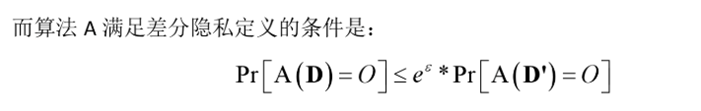

- **目的**：差分隐私是为了防止公开统计性质的数据后，攻击者使用排除法等手段获取某一个别数据的具体信息，造成个人隐私泄露。
若数据集通过A算法处理后满足差分隐私定义，则所有人仅能使用该公开数据集的统计信息，无法确定个别数据的具体信息是什么。
- **定义**：差分隐私本质上就是一种要求，达到该要求则可以有效保护隐私。

- **实现方式**：对数据集添加拉普拉斯噪声是一种常见的实现方式。而拉普拉斯噪声就是满足拉普拉斯分布（和正态分布，均值分布一样是一种概率分布）的一个随机值。
- 学习资料：

    [差分隐私若干基本知识点介绍（一）-CSDN博客](https://blog.csdn.net/maththinker/article/details/51464273)

    [差分隐私若干基本知识点介绍（二）-CSDN博客](https://blog.csdn.net/MathThinker/article/details/51637781)

